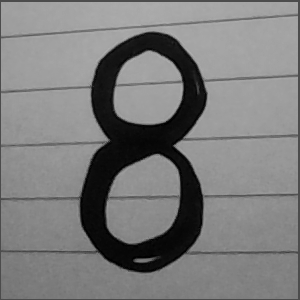

# 포트폴리오

## 성 명

황지용

## 교육과정

## e-mail

## 프로젝트명

OpenCV 카메라 기반 손글씨 숫자 이미지 전처리 프로젝트

## 개발기간

2026.06.29

## 개발 내용

## 개발내용

1. OpenCV의 VideoCapture를 이용하여 웹캠 영상을 실시간으로 입력받는다.
2. 프레임을 좌우 반전하고, 화면 중앙에 300x300 ROI 영역을 표시한다.
3. c 키 입력 시 ROI 영역만 추출하여 그레이스케일 이미지로 변환한다.
4. GaussianBlur와 Otsu 이진화를 적용하여 배경과 숫자 영역을 분리한다.
5. erosion 연산으로 숫자 형태를 정리하고, 숫자가 있는 픽셀의 bounding box를 기준으로 crop한다.
6. crop된 이미지를 반전한 뒤 300x300 검은 배경 중앙에 배치하여 모델 테스트용 이미지로 저장한다.

## 개발언어 및 기술

Python, OpenCV, NumPy, Jupyter Notebook, 영상 처리, 이미지 전처리

## 실행 결과

( 1 ) 웹캠 영상에서 중앙 ROI 영역을 지정하여 숫자 입력 영역을 구성하였다.

( 2 ) 캡처된 ROI 이미지를 그레이스케일과 이진화 이미지로 변환하였다.

( 3 ) 숫자 영역만 자동으로 crop하여 불필요한 여백을 줄였다.

( 4 ) 최종 테스트용 이미지를 300x300 크기로 저장하였다.

## 활용 방안및추후 개발 방향

이 프로젝트는 손글씨 숫자를 카메라로 입력받아 머신러닝 또는 딥러닝 모델에 넣기 전 단계의 이미지 전처리 흐름을 구현한 것이다. 향후 MNIST 기반 CNN 모델이나 KNN 분류 모델과 연결하면 실시간 숫자 인식 프로그램으로 확장할 수 있다.

## 프로젝트를 통해 느낀점

이번 프로젝트를 통해 카메라 입력 영상에서 필요한 영역만 선택하고, 해당 이미지를 모델 입력에 적합한 형태로 가공하는 과정을 이해할 수 있었다. 특히 crop 과정에서 단순히 중앙을 자르는 방식의 한계를 발견하고, 픽셀 좌표 기반 bounding box 방식으로 개선하였다.
