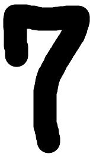

# 포 트 폴 리 오

## 성 명

황지용

## 교육과정


## e-mail


## 프로젝트명

MNIST 손글씨 숫자 분류 프로젝트 - digital.png 예측

## 개발기간

2026.06.28

## 개발 내용

1. `ex_07.ipynb`의 MNIST 손글씨 숫자 분류 코드를 기반으로 `project_02.ipynb`를 작성한다.
2. TensorFlow와 Keras를 이용하여 MNIST 손글씨 숫자 데이터셋을 불러온다.
3. 28x28 크기의 이미지 데이터를 784개의 입력값으로 변환한다.
4. 픽셀값을 0부터 1 사이의 값으로 정규화하여 모델 학습에 적합한 형태로 전처리한다.
5. Keras Sequential 모델을 이용하여 완전연결 신경망 구조를 만든다.
6. Dense 512개, Dense 256개 은닉층과 10개 노드의 출력층으로 모델을 구성한다.
7. 기존 `digit.png` 대신 `digital.png` 파일을 OpenCV로 불러와 동일한 조건으로 전처리한다.
8. 전처리한 `digital.png` 이미지를 모델에 입력하여 손글씨 숫자 예측을 수행한다.

개발언어 및 기술: Python, TensorFlow, Keras, NumPy, OpenCV, Matplotlib, MLP, Jupyter Notebook

## 실행 결과

( 1 ) MNIST 데이터셋을 불러와 학습용 데이터 60,000개와 테스트용 데이터 10,000개의 구조를 확인하였다.

각 이미지는 28x28 크기의 흑백 이미지이며, 완전연결 신경망에 입력하기 위해 784개의 값으로 변환하였다.

( 2 ) Sequential 모델을 사용하여 손글씨 숫자 분류 모델을 구성하였다.

은닉층에는 `relu` 활성화 함수를 사용하고, 출력층에는 0부터 9까지의 숫자 확률을 계산하기 위해 `softmax` 활성화 함수를 사용하였다.

( 3 ) 테스트 데이터 평가 코드를 이용하여 학습된 모델의 성능을 확인하도록 구성하였다.

`model.evaluate(x_images_test_norm, y_test)` 코드를 통해 테스트 데이터에 대한 손실값과 정확도를 확인할 수 있다.

( 4 ) 외부 이미지 `digital.png`를 입력 이미지로 사용하도록 코드를 변경하였다.

```python
img = cv2.imread("digital.png", cv2.IMREAD_GRAYSCALE)
resize_img = cv2.resize(img, (28, 28))
resize_img = resize_img.astype('float32')
inverse_img = 255 - resize_img
inverse_img_norm = inverse_img / 255.0

result = model.predict(inverse_img_norm.reshape(1, 784))
print(result.argmax())
```

OpenCV를 이용해 이미지를 28x28 크기로 변경하고 색상 반전 및 정규화를 적용한 뒤, 기존 `ex_07.ipynb`와 동일한 방식으로 모델에 입력하였다.

## 활용 방안및추후 개발 방향

이번 프로젝트는 기존 MNIST 예제 코드를 유지하면서 입력 이미지만 `digital.png`로 변경하여, 같은 모델과 같은 전처리 조건에서 다른 손글씨 이미지를 예측해 보는 실습 프로젝트이다.

추후에는 여러 장의 직접 작성한 숫자 이미지를 준비하여 반복 예측을 수행하고, 숫자별 예측 결과를 비교할 수 있다. 또한 완전연결 신경망보다 이미지 특징을 더 잘 학습할 수 있는 CNN 구조를 적용하여 실제 손글씨 이미지에 대한 예측 성능을 높일 수 있다.

## 실행 결과 이미지



그림 1. OpenCV로 불러와 예측에 사용한 외부 손글씨 숫자 이미지

## 프로젝트를 통해 느낀점

이번 프로젝트를 통해 같은 MNIST 분류 코드라도 입력 이미지가 달라지면 예측 대상이 달라진다는 점을 확인할 수 있었다. 특히 `digital.png` 파일을 기존 `digit.png`와 동일한 크기 변경, 색상 반전, 정규화 과정을 거쳐 모델에 입력해야 한다는 점이 중요했다.

또한 외부 이미지를 사용할 때는 단순히 이미지 파일만 불러오는 것이 아니라, 학습 데이터인 MNIST 이미지와 최대한 비슷한 형태로 맞추는 전처리 과정이 필요하다는 것을 알 수 있었다.

이번 실습을 통해 기존 코드를 재사용하되 입력 데이터만 바꾸어 새로운 예측 실험을 구성하는 방법을 익힐 수 있었다. 앞으로는 직접 작성한 여러 숫자 이미지를 추가하여 모델이 어떤 숫자를 더 잘 예측하고 어떤 숫자에서 헷갈리는지 비교해 보고 싶다.
