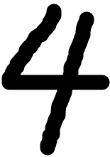

# 포 트 폴 리 오

## 성 명

황지용

## 교육과정

## e-mail

## 프로젝트명

MNIST 손글씨 숫자 분류 프로젝트

## 개발기간

2026.06.26 ~ 2026.06.27

## 개발 내용

1. TensorFlow와 Keras를 이용하여 MNIST 손글씨 숫자 데이터셋을 불러온다.
2. 28x28 크기의 이미지 데이터를 784개의 입력값으로 변환한다.
3. 픽셀값을 0부터 1 사이의 값으로 정규화하여 모델 학습에 적합한 형태로 전처리한다.
4. Keras Sequential 모델을 이용하여 완전연결 신경망 구조를 만든다.
5. Dense 512개, Dense 256개 은닉층과 10개 노드의 출력층으로 모델을 구성한다.
6. 테스트 데이터로 모델 성능을 평가하고, OpenCV로 외부 이미지 `digit.png`를 전처리하여 숫자를 예측한다.

개발언어 및 기술: Python, TensorFlow, Keras, NumPy, OpenCV, Matplotlib, MLP, Jupyter Notebook

## 실행 결과

( 1 ) MNIST 데이터셋을 불러와 학습용 데이터 60,000개와 테스트용 데이터 10,000개의 구조를 확인하였다.

각 이미지는 28x28 크기의 흑백 이미지이며, 완전연결 신경망에 입력하기 위해 784개의 값으로 변환하였다.

( 2 ) Sequential 모델을 사용하여 손글씨 숫자 분류 모델을 구성하였다.

은닉층에는 relu 활성화 함수를 사용하고, 출력층에는 0부터 9까지의 숫자 확률을 계산하기 위해 softmax 활성화 함수를 사용하였다.

( 3 ) 테스트 데이터 평가 결과 약 98.02%의 정확도를 확인하였다.

학습된 모델은 테스트 손실값 0.1753, 테스트 정확도 0.9802를 기록하였다.

( 4 ) 외부 이미지 `digit.png`를 입력하여 예측한 결과 숫자 4로 분류되었다.

OpenCV를 이용해 이미지를 28x28 크기로 변경하고 색상 반전 및 정규화를 적용한 뒤 모델에 입력하였다.

## 활용 방안및추후 개발 방향

이번 프로젝트는 딥러닝을 이용하여 손글씨 숫자 이미지를 분류해 보는 실습 프로젝트이다. 이미지 데이터를 모델에 바로 넣는 것이 아니라, 입력 크기 변환과 정규화 같은 전처리 과정이 필요하다는 점을 확인할 수 있었다.

추후에는 완전연결 신경망보다 이미지 특징을 더 잘 학습할 수 있는 CNN 구조를 적용하여 성능을 높일 수 있다. 또한 사용자가 직접 그린 숫자 이미지를 업로드하면 실시간으로 숫자를 예측하는 웹 또는 GUI 프로그램으로 확장할 수 있다.

## 실행 결과 이미지

그림 1. OpenCV로 불러와 예측에 사용한 외부 손글씨 숫자 이미지

## 프로젝트를 통해 느낀점

이번 프로젝트를 통해 딥러닝 이미지 분류의 기본 흐름을 이해할 수 있었다. 처음에는 28x28 이미지 데이터를 왜 784개의 값으로 변환해야 하는지 헷갈렸지만, 완전연결 신경망은 1차원 입력값을 기준으로 학습한다는 점을 실습을 통해 알게 되었다.

또한 픽셀값을 255로 나누어 정규화하는 과정이 모델 학습과 예측에서 중요하다는 것을 확인하였다. 단순히 모델을 만드는 것뿐만 아니라, 학습 데이터와 실제 입력 이미지의 형태를 동일하게 맞추는 전처리 과정이 결과에 큰 영향을 준다는 점을 배울 수 있었다.

이번 예제를 통해 데이터 준비, 전처리, 모델 구성, 학습, 평가, 외부 이미지 예측까지 하나의 딥러닝 프로젝트 흐름을 경험할 수 있었다. 앞으로는 CNN 모델을 적용하거나 직접 만든 숫자 이미지 데이터를 더 많이 수집하여 모델 성능을 비교해 보고 싶다.
